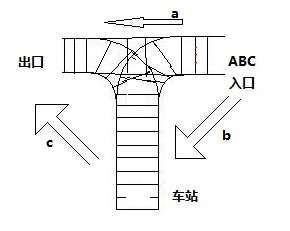

# Data-Structure-Course

## 0x00 顺序表
- 基本操作。初始化、第i个元素前插入一个新的元素、删除第i个元素、查找某元素、顺序表的销毁。
- 建立并显示含有n个整数的顺序表。
- 实现对有序表（非递减）插入一个元素的功能。
- 实现两个有序（非递减）表合并生成新的有序表的功能。
- 顺序查找顺序表，删除元素e（只删除找到的第一个值为e的元素）。
- 顺序查找顺序表，删除元素e（删除所有值为e的元素）。
- 实现顺序表的元素逆置。
- 实现顺序表的清空。
- 删除顺序表中所有多余的元素（即没有相同的元素）。

## 0x01 链表
- 实现单链表的所有基本操作。
- 实现循环链表的基本操作。
- 实现双向链表的基本操作。
- 实现单链表的逆置。
- 删除单链表中所有多余的元素（即没有相同的元素）。
- 判定一个链表是否是循环链表。

## 0x02 一元多项式的表示和相加
线性表的典型应用：多项式的加、减、乘运算的实现。
- 多项式的创建。
- 多项式的相加。
- 多项式的相减。
- 多项式的相乘。
- 多项式的求值。

## 0x03 约瑟夫问题
设有n个人围坐一圈，从第s个人开始报数，数到第m个人出列，然后从出列的下一个人开始重新报数，数到第m个人又出列。如此反复，直到所有人全部出列。对于任意给定的n,s,m，求按出列次序得到的n个人的序列。

## 0x04 静态链表
**静态链表代码有问题，需要重写**  
设计一个静态链表（或称为数组链表），该链表储存的数据类型为string。
- 构造函数。
- 含参构造函数，创建最大长度为size的静态链表。
- 求长度函数。
- 判断是否已满。
- 判断是否为空。  
- 清空链表。
- 获取链表第position位置的元素。
- 将链表第position位置的元素换为x。
- 获取并删除链表第position位置的元素。
- 将元素x插入到链表第position位置。
- 将元素x追加到链表尾部。

## 0x05 栈
- 定义顺序栈类型，实现栈的所有基本操作。
- 定义链栈类型，实现栈的所有基本操作。
- 栈的应用，实现数制的转换功能的函数。

## 0x06 列车出站问题
每一时刻，列车可以从入口车站或直接从入口进入出口，再或者从车站进入出口。即每一时刻可以有一辆车沿着箭头a或b或c的方向行驶。现在有一些车在入口处等待，它们要通过上述的方式从出口出来，现在你要统计出所有可能的出站序列。输入进站序列，输出所有可能的出站序列。  

## 0x07 栈的应用
- 括号的匹配。
- 表达式的求值。

## 0x08 循环队列和链队列
- 定义顺序队列类型，实现队列的所有基本操作。
- 定义链队列类型，实现队列的所有基本操作。

## 0x09 队列的应用
队列的简单应用，例如打印机的打印队列。

## 0x0A 二叉树
- 定义二叉链表类型。
- 实现二叉树的基本操作：建立、先中后序遍历、层次遍历及输出。
- 求二叉树的深度、总结点数、叶子结点数、二叉树的复制等。

## 0x0B 线索二叉树
- 定义线索链表类型，实现线索二叉树的基本操作。

## 0x0C 哈夫曼树
- 建立哈夫曼树的数据结构，实现哈夫曼编码和译码。

## 0x0D 图
- 建立并显示图的邻接矩阵。
- 建立并显示图的邻接表。
- 实现图的深度优先和广度优先遍历。
- 实现最小生成树的算法。
- 实现拓扑排序算法。
- 实现最短路径算法。
- 实现关键路径算法。

## 0x0E 查找
- 实现二分查找算法。
- 实现二叉搜索树的建立、查找和删除。
- 实现哈希表。

## 0x0F 排序
**待完成**
- 插入排序。
- 选择排序。
- 冒泡排序。
- 希尔排序。
- 快速排序。 
- 堆排序。
- 归并排序。
